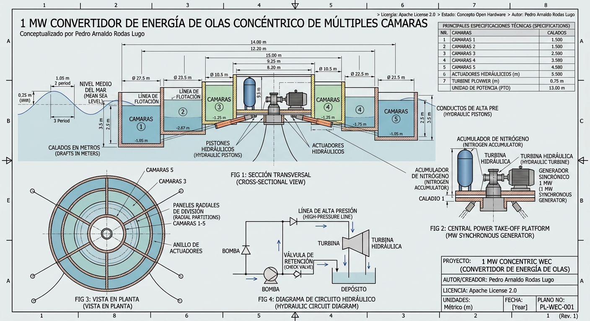

# 🌊 OWC-MC Hydro-PTO: Convertidor de Energía Ondimotriz Multicámara Concéntrico

> **Licencia:** [Apache License 2.0](LICENSE)
> (https://creativecommons.org/licenses/by/4.0/)  
> **Estado:** Concepto de Innovación Abierta (Open Source / Open Hardware)  
> **Autor:** Pedro Arnaldo Rodas Lugo

---

## 📌 1. Resumen Ejecutivo

El **OWC-MC Hydro-PTO** es un concepto de convertidor de energía de las olas (*Wave Energy Converter - WEC*) de estructura flotante cilíndrica de $35\text{ m}$ de diámetro. 

Diseñado para resolver el problema del **ancho de banda espectral restringido** de los captadores tradicionales, el dispositivo utiliza **5 cámaras concéntricas independientes** con profundidad escalonada. Esto permite capturar eficientemente ondas de diferentes períodos (desde mar picado de corta frecuencia hasta marejadas largas). La energía neumática/hidrodinámica de las 5 cámaras se integra mediante un sistema PTO (*Power Take-Off*) hidráulico común asistido por acumuladores de nitrógeno, generando **1 MW de potencia eléctrica continua**.

---

## 📐 2. Fundamentos Hidrodinámicos y Cálculos

### 2.1 Ecuación de Gobierno de Movimiento (Dominio del Tiempo)
La respuesta hidrodinámica del cuerpo flotante y las columnas de agua internas se rige por la formulación de Cummins acoplada con la fuerza del PTO:

$$(M + A_\infty) \ddot{x}(t) + \int_{0}^{t} K(t - \tau) \dot{x}(\tau) d\tau + C x(t) = F_{exc}(t) - F_{PTO}(t)$$

Donde:
* $M$: Matriz de masa de la estructura.
* $A_\infty$: Masa añadida a frecuencia infinita.
* $K(t)$: Función de memoria de radiación hidrodinámica.
* $C$: Coeficiente de restitución hidrostática.
* $F_{exc}(t)$: Fuerza de excitación del oleaje entrante.
* $F_{PTO}(t)$: Fuerza de reacción no lineal ejercida por los pistones hidráulicos.

---

### 2.2 Sintonización Resonante por Cámaras
La frecuencia natural de oscilación $\omega_i$ de la columna de agua dentro de cada cámara concéntrica $i$ depende de su profundidad sumergida efectiva $d_i$:

$$\omega_i = \sqrt{\frac{g}{d_i + \Delta d_i}}$$

Para un espectro de olas característico con períodos entre $4\text{ s}$ y $12\text{ s}$, la geometría escalonada se distribuye según la siguiente relación de calados:

| Cámara $i$ | Geometría | Diámetro / Ancho | Calado ($d_i$) | Período Resonante ($T_i$) |
| :--- | :--- | :--- | :--- | :--- |
| **Cámara 1 (Centro)** | Cilindro Central | $R_1 = 3.5\text{ m}$ | $22.0\text{ m}$ | $T_1 \approx 9.4\text{ s}$ |
| **Cámara 2** | Anillo 1 | $\Delta R_2 = 3.0\text{ m}$ | $17.0\text{ m}$ | $T_2 \approx 8.2\text{ s}$ |
| **Cámara 3** | Anillo 2 | $\Delta R_3 = 3.5\text{ m}$ | $13.0\text{ m}$ | $T_3 \approx 7.2\text{ s}$ |
| **Cámara 4** | Anillo 3 | $\Delta R_4 = 3.5\text{ m}$ | $9.5\text{ m}$ | $T_4 \approx 6.2\text{ s}$ |
| **Cámara 5 (Exterior)**| Anillo Perimetral | $\Delta R_5 = 4.0\text{ m}$ | $6.0\text{ m}$ | $T_5 \approx 4.9\text{ s}$ |

---

### 2.3 Balance de Potencia Hidráulica (PTO)
La potencia media capturada $P_{media}$ por los 5 actuadores acoplados a las cámaras se define como:

$$P_{media} = \frac{1}{T} \int_{0}^{T} \sum_{i=1}^{5} \Delta p_i(t) \cdot Q_i(t) \, dt$$

Donde $\Delta p_i(t)$ es la caída de presión en el pistón de la cámara $i$ y $Q_i(t)$ es el caudal de fluido hidráulico desplazado.

---

## 🛠️ 3. Diagramas Arquitectónicos (Mermaid)

### 3.1 Corte Transversal de la Estructura Flotante
*(Diagrama de disposición física de las cámaras y la profundidad graduada)*

```mermaid
graph TD
    subgraph Cubierta_Superior ["Cubierta Rígida (Zona de Maquinaria y PTO)"]
        PTO1["Pistón Central"]
        PTO2["Pistones Anillo 2"]
        PTO3["Pistones Anillo 3"]
        PTO4["Pistones Anillo 4"]
        PTO5["Pistones Anillo Exterior"]
    end

    subgraph Estructura_Sumergida ["Cilindro Concéntrico ($35\text{ m}$ Ø)"]
        C1["Cámara 1 (Centro)<br/>Calado: 22m"]
        C2["Cámara 2<br/>Calado: 17m"]
        C3["Cámara 3<br/>Calado: 13m"]
        C4["Cámara 4<br/>Calado: 9.5m"]
        C5["Cámara 5 (Exterior)<br/>Calado: 6m"]
    end

    C1 --- PTO1
    C2 --- PTO2
    C3 --- PTO3
    C4 --- PTO4
    C5 --- PTO5f
